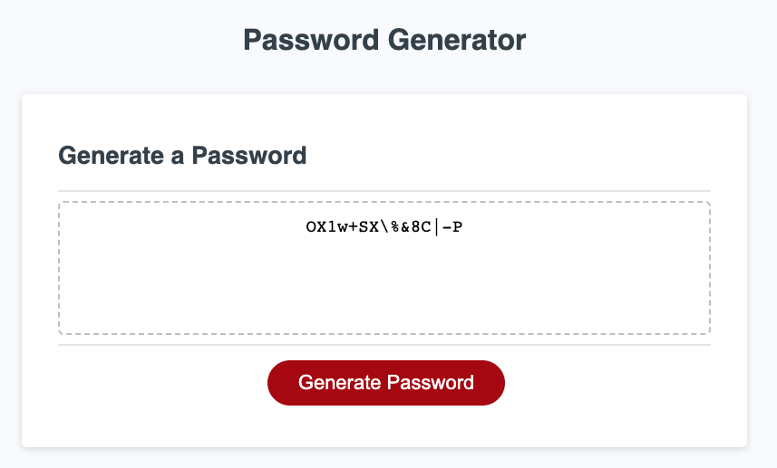

# Password Generator

## Description

This project is a simple yet powerful password generator, designed to create secure passwords based on user-defined criteria.

- **Motivation**: The motivation behind this project was to create a tool that can generate strong, secure passwords, thereby enhancing online security.
- **Purpose**: This project aims to solve the problem of weak, easily guessable passwords by providing a utility that generates strong, unique passwords.
- **Problem it Solves**: It offers a quick and easy way for users to create secure passwords, thus enhancing their online security.
- **What I Learned**: Through this project, I gained deeper insights into JavaScript, especially in areas like loops, conditionals, and string manipulation. I also learned how to make a more user-friendly interface.

## Installation

To view the portfolio, simply navigate to the deployed website. For a local copy, clone the repository and open the `index.html` file in a web browser.

## Usage

1. Click the "Generate Password" button.
2. Follow the on-screen prompts to select your password criteria.
3. Once all prompts are answered, your password will be displayed.

Visit the deployed website: [Isaac's Portfolio](https://isaacmasterman.github.io/M03C-PasswordGenerator/)

## Credits

NA

## License

This project is licensed under the terms of the MIT license.
